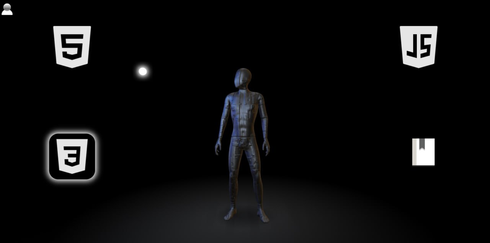
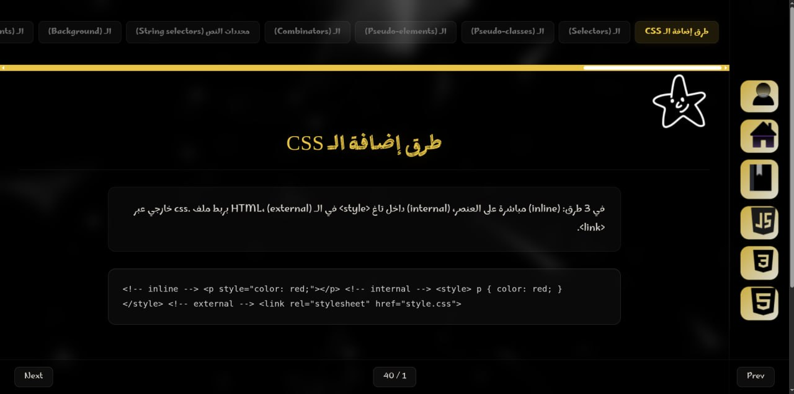
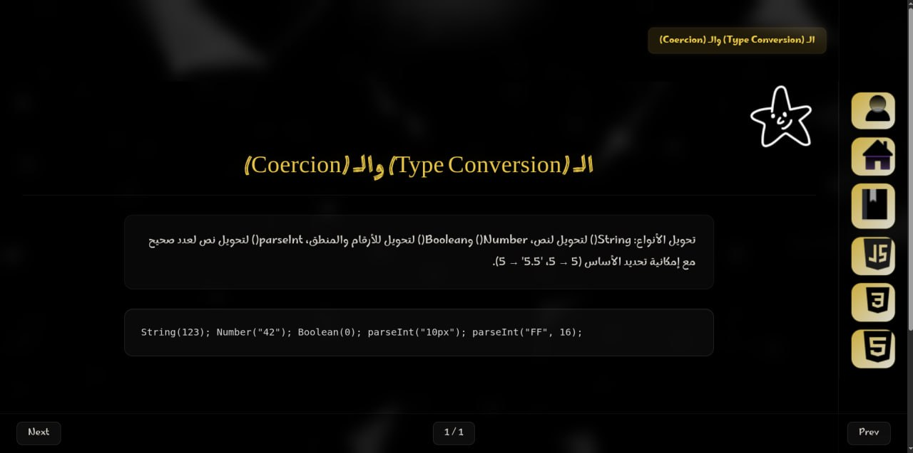

<div align="center">

# 🎓 Educational Web Project

**An interactive frontend learning platform — HTML, CSS & JavaScript lessons with a 3D twist.**


</div>

---

## ✨ Overview

**Educational Web Project** turns frontend learning into an interactive experience. It breaks down HTML tags, CSS properties, and JavaScript concepts into short, digestible lessons — with a bookmark system to save what matters and a 3D robot that turns its body and head to follow your cursor. 🤖

---

## 📌 Features

| | |
|:---:|---|
| 📚 | Short, focused lessons for HTML, CSS & JavaScript |
| 🤖 | Interactive 3D robot (Spline) that turns its body & head to follow your cursor |
| ⭐ | Bookmark system — save & remove lessons anytime |
| 💾 | Progress and bookmarks saved via browser Local Storage |
| 💡 | The last visited section is highlighted in white |
| 🧭 | Smart navigation — resumes your last visited lesson |
| 🗂️ | Lessons ordered in a guided learning sequence |
| ✍️ | Personal page with handwritten study notes |

---

## 🖥️ Pages

<table>
<tr>
<td width="25%" align="center"><b>🏠 Home</b></td>
<td>3D robot that turns its body & head to follow your cursor, plus 5 quick-access icons: HTML, CSS, JS, Personal, Bookmark. The icon of the last visited section is highlighted in white.
</td>
</tr>
<tr>
<td align="center"><b>📖 Lessons</b></td>
<td>HTML, CSS & JS lessons loaded from a separate data file. Star ⭐ any lesson to bookmark it.</td>
</tr>
<tr>
<td align="center"><b>🔖 Bookmarks</b></td>
<td>All saved lessons in one place — unstar to remove.</td>
</tr>
<tr>
<td align="center"><b>👤 Personal</b></td>
<td>Handwritten notes documenting the author's learning journey.</td>
</tr>
</table>

---

## 📸 Screenshots

<table>
<tr>
<td align="center"><b>🏠 Home — 3D Robot</b></td>
<td align="center"><b>📖 Lesson Page</b></td>
</tr>
<tr>
<td></td>
<td></td>
</tr>
</table>

<p align="center"></p>

---

## 🛠️ Built With

`HTML5` · `CSS3` · `JavaScript` · `Local Storage` · `Spline 3D` · `VS Code` · `Live Server` · `AI-assisted development`

---

## ⚙️ Requirements

- 🧩 Visual Studio Code
- 🔌 [Live Server](https://marketplace.visualstudio.com/items?itemName=ritwickdey.LiveServer) extension by Ritwick Dey
- 🌐 A modern browser (Chrome, Firefox, Edge, Safari)

---

## 🔍 How It Works

- Lessons are stored in the `data.js` file.
- Lessons are dynamically rendered using JavaScript.
- Bookmarked lessons are saved in `localStorage`.
- The last visited section is saved using `localStorage`.
- The 3D robot responds to the user's cursor movement.

---

## 🚀 Installation

```bash
git clone https://github.com/hadi-al-sous-projects/educational-web-project.git
```

1. Open the project folder in **VS Code**
2. Install the **Live Server** extension
3. Right-click `index.html` → **Open with Live Server**

---

## ▶️ Usage

The site launches at:

```text
http://127.0.0.1:5500/index.html
```

Navigate with the home page icons → pick a section → ⭐ star lessons to save them → check them anytime in **Bookmarks**.

---

## 📂 Project Structure

```text
educational-web-project/
├── index.html
├── lessons.html
├── photos.html
├── index.css
├── normalize.css
├── photos.css
├── sections.css
├── data.js
├── bringdata.js
├── vproject/
├── lessonsphotos/
├── background/
└── images/

```

---

## 🔮 Future Plans

- 🏷️ Bookmark categories and server-side saving
- 📝 Lessons for React and Tailwind CSS

---

## 🙌 Credits

- [Spline](https://spline.design) — 3D robot model
- [Shields.io](https://shields.io) — badges

---

## 👨‍💻 Author

**Mohammad Hadi Alsous**
🔗 [github.com/hadi-al-sous-projects/educational-web-project](https://github.com/hadi-al-sous-projects/educational-web-project)

## 📄 License

This project was created for educational purposes.
You are free to use, study, and improve the code.